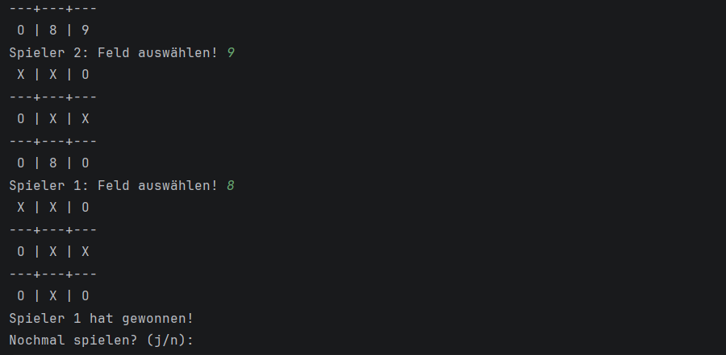
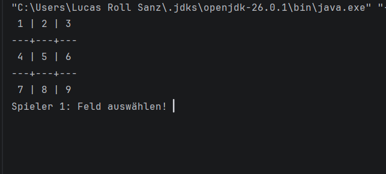

# [TicTacToe]
•	Modellieren Sie eine geeignete Klasse Auto.
•	Modellieren Sie eine geeignete Klasse Warteschlange. (Verwenden Sie zum Verwalten der gewünschten Anzahl an Autos eine Liste.)
•	Erstelle eine Konsolen Applikation, welche das gegeben Problem mittels Menü steuern lässt
•	ERWEITERUNG (Fortgeschrittene): automatische Abarbeitung der Liste mittels Thread/Runnable

## 📋 Projektinformationen

| Feld              | Inhalt                          |
|-------------------|---------------------------------|
| **Projektname**   | [TicTacToe]                      |
| **Klasse**        | [1aAPC]                  |
| **Schuljahr**     | [2025/26]                 |
| **Abgabedatum**   | [08.07.2026]                    |
| **Autor/in**      | [Lucas Alim Roll Sanz]              |
| **Lehrer/in**     | [G. Jarz]              |
| **Fach**          | [ITL 1/2] |

---

## 📝 Projektbeschreibung

Vor einer Autowaschanlage gibt es regelmäßig eine Schlange an Autos, die gewaschen werden sollen. Es soll nun ein Programm entwickelt werden, welches diese Warteschlange verwaltet. Aus Erfahrungsgründen (und aus Platzgründen) sind nie mehr als 10 Autos in dieser Schlange. Natürlich soll sich ein neu hinzukommendes Auto am Ende der Schlange anstellen (solange noch Platz ist), außerdem sollen alle wartende Autos aufrücken, wenn das an erster Stelle stehende Auto in die Anlage einfahren darf, Autos können natürlich jederzeit die Schlange verlassen und wieder "nach Hause" fahren

## 📸 Screenshot

